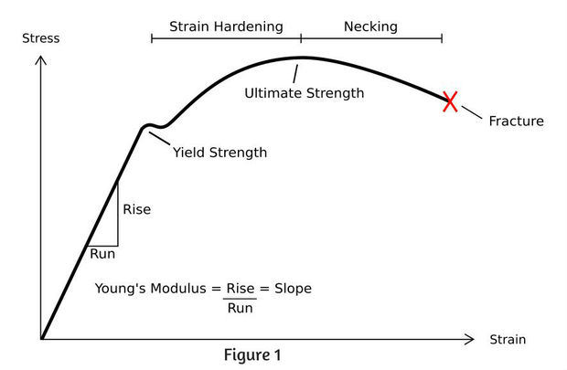

# Theory and Overview

Somehow we have to get from a force to a number that our computer can read which represents that force. The translation consists of a few different steps. If you don't read the rest of this page, focus on the 6 steps outlined below, they will give you a gist of the entire process. You could also read the poster I made for this project which can be found here.

1. Translate a force into a small deformation of a material. When you pull on the aluminum body of the sensor, it bends and stretches.
2. Use this movement to stretch and change the electrical resistance of a "Strain Gauge," a wafer-thin sensor covered in tiny wires.
3. Use a circuit called a "Wheatstone Bridge" to translate this small change in electrical resistance into a small change in electrical voltage.
4. Amplify this small change in voltage into a bigger change in voltage and read this into a tiny little computer called an Arduino.
6. Send this data to our computer wirelessly via bluetooth, and then do cool stuff with it on our computer.

I'll be talking about some of the interesting physics that happen during the first couple steps, but if you want you can skip the explanation. You should be able to understand the rest of the project without this theory.

## Stress to Strain Conversion
Quickly, some terms:

- Strain: the amount that a material stretches.
- Stress: the amount of internal force that develops in a material due to this strain, which usually tries to make the material return to its original shape. This is equal and opposite to the external force that must be applied to maintain this amount of strain.
- Stress-Strain Curve: the relationship between these two quantities. For instance, you tell me how strained something is and I can tell you how much stress is in the object, and from this we can tell how much force is being applied to it.

​Every material has a different stress-strain curve. For instance, with clay, when you stretch it, it doesn't rebound to it's original shape, so this means that the stress in the material is zero at any level of strain. A rubber band might have a stress-strain curve that looks like the graph below:

On the left side of the figure, at small amounts of strain, the rubber band has a linear stress-strain curve relationship: doubling the stretch results in double the restoring force. If you stretch too far, past the yield strength of the material, then the material might not rebound all the way back to the original shape. If you go past the ultimate strength, then the stress peters off, and it gets easier the farther you go.

Many everyday materials (including aluminum, the material that I made the sensor out of) have a stress strain curve that looks similar to the one pictured above. This is great, because if we don't exceed the yield strength of the material, and stay on the far left of the graph, in the so called "linear" or "elastic" region, it makes it easy to relate stress and strain to each other. All we have to do is measure the strain and stress at two different places along the curve (e.g. measure the strain with 0 pounds on the sensor and do the same with 10 pounds on the sensor), and then we can use these two data points to fit a straight line and predict the stress at any other strain level!

Additionally, many materials, including aluminum, have the property that they share the strain and stress consistently throughout the shape of the object. This doesn't necessarily mean that the strain and stress is the same everywhere in the object (usually it's not, as you could imagine), but that if you double the strain, the stress will double everywhere in the object. This is useful because it means that we can 1) build a shape that is more complicated than a simple bar that you pull on both ends, and 2) we can measure the strain anywhere we want in the object.

So now we just need a way of measuring the strain in our aluminum.
